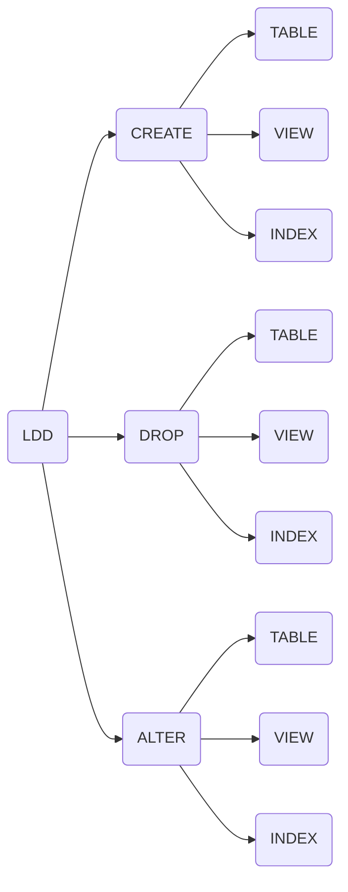

# LDD

## CREATE TABLE
ejemplo de comando create table
```sql
CREATE TABLE tabla (col1 tipo_de_datos[NOT NULL][RESTRICCIONES])
```
### RESTRICCIONES 
* IDENTITY:

  proporciona una valor incremental que va sumando por cada fila que se crea se suele usar en las PRIMARY KEY POR EJ:<BR>
  ```sql
  Personid int IDENTITY([numero en el que empieza],[numero que se incrementa]) ,
  ```
  EJ REAL:
  ```sql
  CREATE TABLE Persons (
    Personid INT IDENTITY(1,1) PRIMARY KEY,
    LastName VARCHAR(255) NOT NULL,
    FirstName VARCHAR(255),
    Age INT
    );
  ```
* PRIMARY KEY:<br> 
es una clave que identifica a la tabla **DEBE SER UNICO** y es recomendable que no lo cree el usuario y que se cree automaticamente:
ej
    ```sql
    Personid int PRIMARY KEY,
    ```
    ejemplo real:
  ```sql
  CREATE TABLE Persons (
    Personid INT IDENTITY(1,1) PRIMARY KEY,
    LastName VARCHAR(255) NOT NULL,
    FirstName VARCHAR(255),
    Age INT
  );
    ```
* FOREIGN KEY:<br>
  es cuando un dato es otra tabla por lo que se usa la clave de la otra tabla <br>
  ej manera 1:
  ```sql
  c2 INT FOREIGN KEY REFERENCES tabla_objetivo(c1)
  ```
  ej real manera 1:
  ```sql
  CREATE TABLE Orders (
    OrderID int NOT NULL PRIMARY KEY,
    OrderNumber int NOT NULL,
    PersonID int FOREIGN KEY REFERENCES Persons(PersonID)
    );
  ```
  ej real manera 2:
  ```sql
  CREATE TABLE Orders (
    OrderID int NOT NULL,
    OrderNumber int NOT NULL,
    PersonID int,
    PRIMARY KEY (OrderID),
    CONSTRAINT FK_PersonOrder FOREIGN KEY (PersonID)
    REFERENCES Persons(PersonID)
  );
  ```
* REGLAS DE BORRADO  Y DE ACTUALIZACIÓN:<BR>
  -  Indica en la definición de la
    FOREIGN KEY qué debe ocurrir en la tabla referencial cuando hay un intento de
    modificar o borrar un valor de PRIMARY KEY<BR>
       - NO ACTION(Valor por defecto):<br>
        NO ACTION define que no hace nada<br>
        ej update:
          ```sql 
          CREATE TABLE padres (
            id INT PRIMARY KEY
          );

          CREATE TABLE hijos (
            id INT PRIMARY KEY,
            padre_id INT,
            FOREIGN KEY (padre_id) REFERENCES padres(id) ON UPDATE NO ACTION
          );
          ```
          ej delete:
          ```sql
            CREATE TABLE padres (
              id INT PRIMARY KEY,
              nombre VARCHAR(50)
            );
            CREATE TABLE hijos (
              id INT PRIMARY KEY,
              nombre VARCHAR(50),
              padre_id INT,
              FOREIGN KEY (padre_id) REFERENCES padres(id) ON DELETE NO ACTION
            );
          ```
      - CASCADE:<BR>
        hace la accion en cascada es decir al hacerlo en la tabla donde lo haces tambien lo borras en las tablas referidas<br>
        ej de update
        ```sql
        CREATE TABLE padres (
          id INT PRIMARY KEY,
          nombre VARCHAR(50)
        );

        CREATE TABLE hijos (
          id INT PRIMARY KEY,
          nombre VARCHAR(50),
          padre_id INT,
          FOREIGN KEY (padre_id) REFERENCES padres(id) ON DELETE CASCADE
        );
        ```
        ej de delete:
        ```sql
        CREATE TABLE padres (
          id INT PRIMARY KEY,
          nombre VARCHAR(50)
        );

        CREATE TABLE hijos (
          id INT PRIMARY KEY,
          nombre VARCHAR(50),
          padre_id INT,
          FOREIGN KEY (padre_id) REFERENCES padres(id) ON DELETE NO ACTION
        );
        ```

  
    


